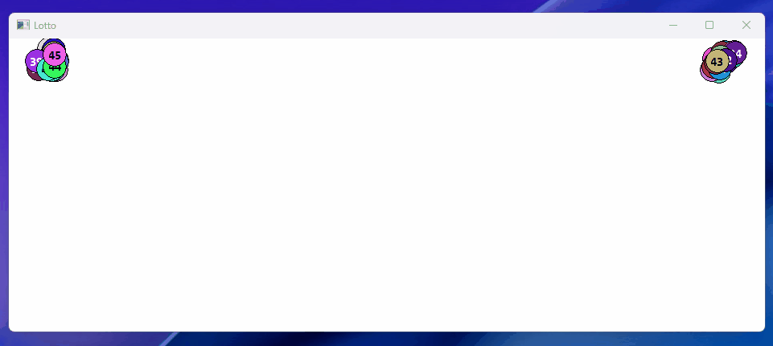

# 📌 Lotto 
Windows Legacy API와 GDI를 이용한 2D 그래픽의 로또 추첨기입니다. 
이 프로젝트는 MIT 라이선스 하에 제공되어 누구나 자유롭게 사용, 수정, 배포할 수 있습니다. 개인 또는 상업적 용도로도 활용이 가능합니다. 
  
## 📝 Description 
"Lotto"는 선형 난수 생성기를 이용해 만든 간단한 복권 추첨기입니다. 
프로그램 실행시 2D 그래픽 기반의 공들이 화면 양측으로 흩뿌려지고 마우스와 상호작용 합니다. 
반사 작용을 이용해 벽에 튕기거나 마우스로 공을 치는 등의 간단한 물리 작용을 구현하였습니다. 
마우스 좌클릭으로 추첨된 공을 화면에 출력하거나 숨길 수 있으며, 우클릭으로 재추첨할 수 있습니다.
  
## 🚀 Getting Started 
### 🔧 Dependencies 
Windows 10 이상 
 
### 📥 Installing 
[Releases](https://github.com/stdsic/Lotto/releases) 페이지에서 최신 버전을 확인하실 수 있습니다. 
압축 해제 후 `Lotto.exe` 또는 `LottoInstaller.exe`를 실행합니다. 
설치 파일(LottoInstaller.exe)을 다운로드한 경우 안내에 따라 안전하게 실행 파일(Lotto.exe)을 설치하시면 됩니다. 
 
### ▶️ Executing program 
- Lotto.exe 
  
## ❓ Help 
- 'R'키를 눌러 공을 다시 생성할 수 있습니다.
  
## 👤 Authors 
- stdsic — @https://github.com/stdsic/Lotto 
  
## 📚 Version History 
- 1.0.1 
  - 메타 데이터 수정
- 1.0.0 
  - 최초 릴리스 
  
## 🧾 License 
이 프로젝트는 [MIT License](LICENSE)로 라이선스되어 있습니다. 
자세한 정보는 LICENSE 파일을 참고하시기 바랍니다. 
 
